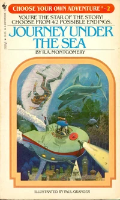
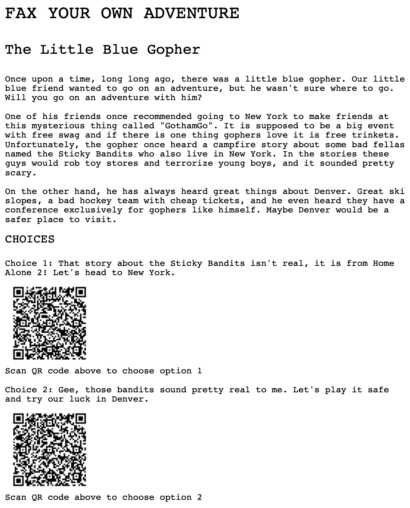
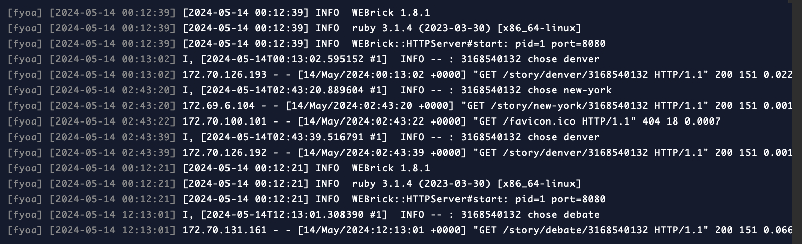

My friend, Greg Swan, a social media marketing guru, [decided to buy an old-skool fax machine](https://gregswan.substack.com/p/fax-me-no-seriously-send-me-a-fax) and asked folks to send him faxes. He's been getting some very creative and hilarious responses. Yesterday, I had a thought, "what if I made a Choose Your Own Adventure game via fax?!" Here's how it all came together.

_I remember reading this book in fourth grade_{: style="display: block; text-align: center;"}

Step one was to get content for an adventure. I didn't have any of the old books I could copy so I perused github for anyone who had implemented a CYOA game. I found this [Go language exercise repo with a story](https://github.com/gophercises/cyoa/blob/master/students/barisere/gopher.json) written by **barisere**. And it was nicely formatted in JSON so I could simply parse the story and various choices.

Step two was to figure out, how would I fax this? As a result of a yearlong fight in 2020 with my insurance provider to get transgender health care coverage, I happened to still have a [fax.plus](https://www.fax.plus/) account. They also have an API to send faxes!

Step three was determining a way for Greg to choose the various options. Sadly, fax.plus does not give me a fax number and Twilio's faxing API was discontinued in 2021. But I do know that I can generate QR codes. So all I had to do was generate a URL for each choice, encode them into QR codes, and embed them on the pieces of the story I would fax him. Then when he scans one of the options, send the next part the story.

{: height="400" }
_Page one of the story, showing the target layout_{: style="display: block; text-align: center;"}

In order to send a fax, I needed to put the story and the QR code options into a PDF and then send it off to fax.plus.

My original design was to generate an initial page of the story by visiting `https://my-app.com/story/intro/5551234567`. This would generate the intro page PDF and fax the PDF using the fax.plus API. Embedded within the page would be QR codes for each option, each one linking to URLs corresponding to the next page, e.g. `https://my-app.com/story/denver/5551234567` and `https://my-app.com/story/new-york/5551234567`.

So the URL has two inputs: the unique identifier of the part of the branch of the story to render and the phone number to fax it to. I wrote a [simple ruby sinatra API](https://github.com/erithmetic/fyoa/) to handle this.

As I proceeded, however, I realized I didn't want to spend a ton of time on this, so I nixed the idea of sending the fax via API. In fact, I could just generate each PDF ahead of time and have the web app just notify me when Greg chose a QR code option.

I spent some time trying to get Twilio to send me an SMS but Twilio has really gone down hill recently and I was unable to just send a simple message. It was a combination of the confusing option for sending texts and having to get a 1-888 number verified that forced me to give up. In the end, I would just watch the logs of the web app to see when Greg made a choice and manually send the fax via fax.plus. I am my own AI-era mechanical Turk!

I deployed my tiny sinatra app onto Digital Ocean's [managed app service](https://www.digitalocean.com/try/app-platform) that is almost as good as Heroku was back in the day.

I then wrote [a script](https://github.com/erithmetic/fyoa/blob/main/generate.rb) to generate all the PDFs. I used the eternally-incredible [prawn](https://prawnpdf.org/docs/prawn/2.5.0/) gem. To generate the QR codes, I used the handy [rqrcode](https://github.com/whomwah/rqrcode?tab=readme-ov-file#rqrcode) gem.

I sent the intro page and I waited...

And I got a reply! Well, Greg was cheeky and chose both options, so I acted like a computer and only sent the first option he chose. And hilarity ensued!

There's a certain level of satisfaction to translating the ditial world into something physical and tangible (by Greg) and the excitement of waiting for your friend to read a dorky story about a Gopher and scan the QR codes.

Next steps for this if I had a ton of time would be to use AI to generate the story. Then, we'd have a perfect union of the pre-internet (fax) era, the web 1.0 (HTTP/PDF) era, the web 2.0 (QR code) era, and the AI era! There's gotta be some way to shoehorn cryptocurrenty into it, too!
